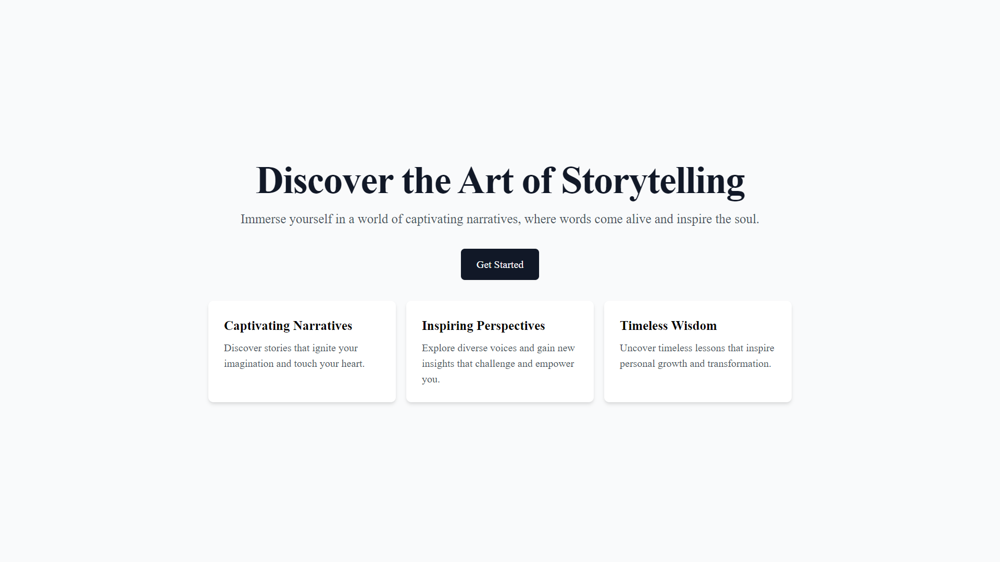
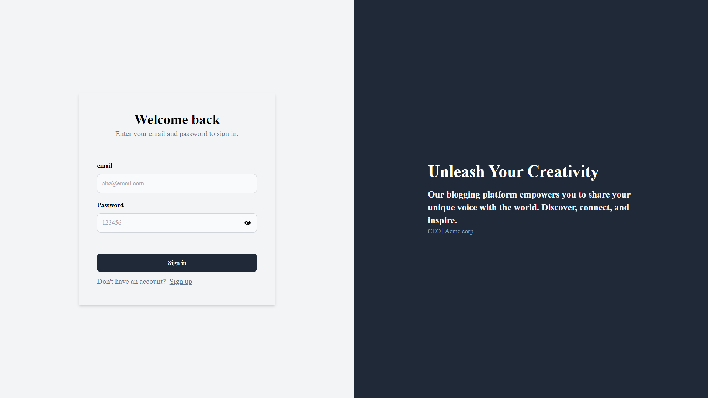
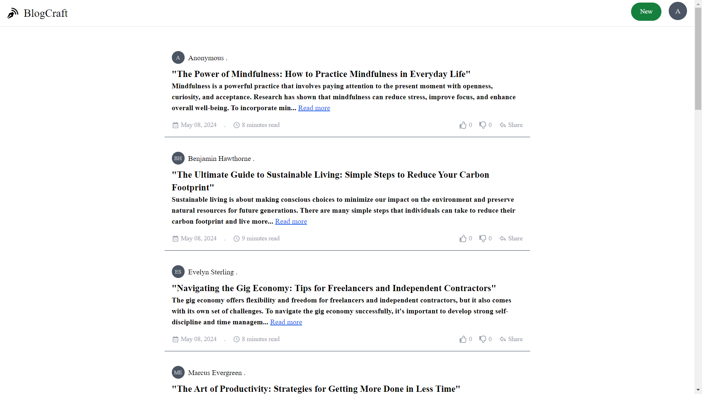
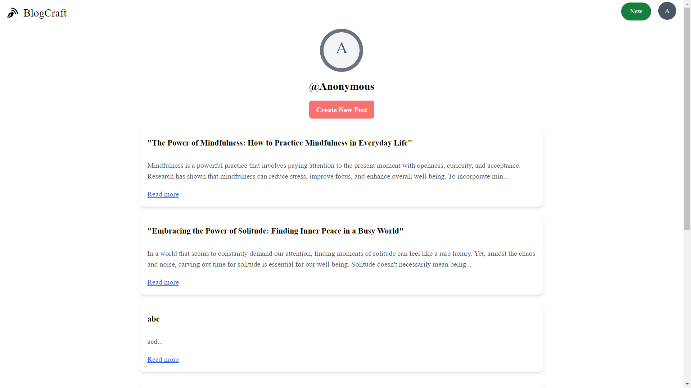

# Blogging Website Project

## Overview

This project is a modern and efficient blogging website developed using a combination of cutting-edge technologies, aimed at providing a seamless and secure experience for both writers and readers.

## Technologies Used

- **Frontend:** React, TypeScript
- **Backend:** Cloudflare Workers
- **Database:** PostgreSQL
- **ORM:** Prisma with connection pooling
- **Authentication:** JWT

## Features

- **Secure Authentication:** Utilizes JWT tokens for secure user authentication.
- **Efficient Data Management:** Prisma ORM with PostgreSQL ensures efficient handling and scalability of blog content.
- **Type Safety:** TypeScript enhances code quality and maintainability by providing robust type safety.
- **Modern UI:** React frontend ensures a modern and responsive user interface.

# demo

## Getting Started

### Prerequisites

- Node.js installed on your machine
- PostgreSQL database setup

### Installation

1. Clone the repository: `git clone https://github.com/prathmesh0125/BlogCraft.git`
2. Install dependencies: `cd frontend & cd backend && npm install`
3. Start the development server: `npm run dev`

## Usage

- Visit the deployed website to explore the blogging platform.
- Sign up or log in to start writing and publishing your blog posts.
- Browse through published posts and engage with other users through comments and likes.

## Contributing

Contributions are welcome! Feel free to fork the repository and submit pull requests for any improvements or additional features.

## Contact

For any inquiries or feedback, please contact [Prathmesh bidve](mailto:bidveprathmesh590@gmail.com).
